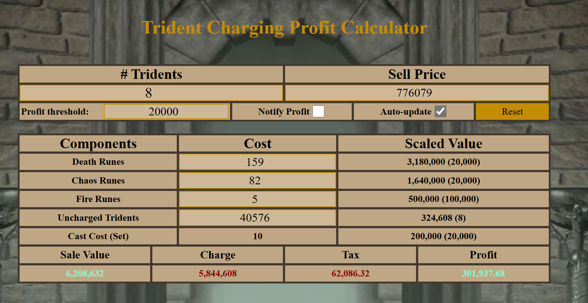

# OldSchool Runescape Trident Profit Calculator

A web application to calculate the costs, taxes, and profits of tridents in the game OldSchool Runescape. Users can input values, and the calculator fetches the latest prices from the Runescape API and updates the displayed values accordingly. The application also includes an autoupdate feature and audio notifications based on user-defined profit thresholds.
- Live demo here: https://osrs-trident-calc.netlify.app/

## How It's Made:

**Tech used:** HTML, CSS, JavaScript

The OSRS Trident Profit Calculator is built using HTML, CSS, and JavaScript. It features a custom class called Calculator in JavaScript that performs all the necessary calculations and updates the values displayed on the page.

## Features
- Fetches latest item prices from Runescape API
- Calculates trident costs, taxes, and profits based on user input
- Automatically updates prices and calculations every two minutes with autoupdate feature
- Plays an AI-generated audio notification when the profit per trident is higher than the user-defined threshold
- Responsive design for different devices

## Optimizations
Some optimizations done:
- Code readability: Improved variable names and added comments explaining the purpose of each function or block of code
- Code organization and modularity: Separated concerns by using the Calculator class for calculations and rendering, while the API class handles data fetching
- Code efficiency: Instead of creating a new Calculator object every time an input changes, the existing object now updates its internal state and re-renders

Potential future optimizations:
- Fix the audio notification to not trigger on ever manual value change while checked. (It's just fun to hear it, to be honest. AI is cool.)
- Implement a more robust error handling system to handle potential edge cases and inform users of any issues that may occur during execution
- Optimize the rendering process by only updating the parts of the UI that have changed, rather than re-rendering the entire UI each time there is an update (likely through the use of a framework such as React)
- Implement caching or local storage to store fetched data and reduce the number of API calls, improving performance and reducing the chance of reaching API rate limits

## Lessons Learned:
Through the development of this project, several valuable lessons were learned:

- Building modular code using classes improves maintainability and readability.
- Leveraging APIs to fetch real-time data enhances the functionality and relevance of applications.
- Implementing additional features, like audio notifications and autoupdate, can improve user experience.
- Separating concerns within the code allows for more efficient and organized code.
